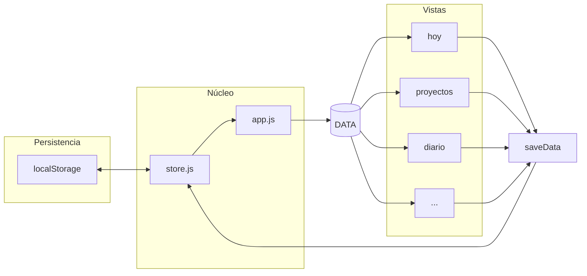
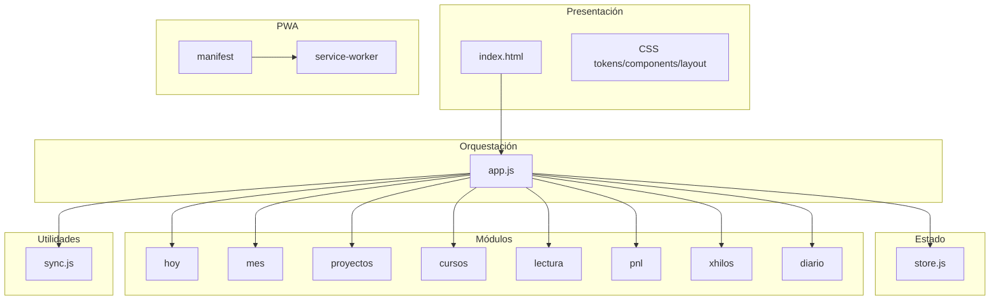
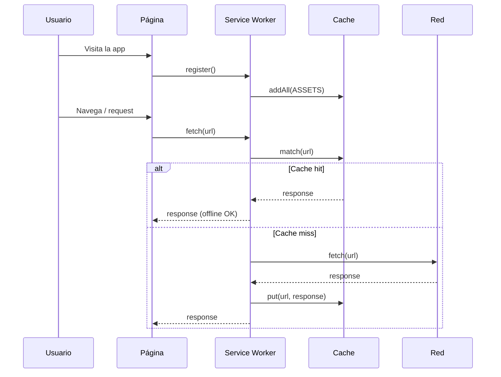

# Big Picture — Arquitectura del Sistema Nexus-dashboard (Mi Espacio Personal)

Este documento describe la arquitectura completa del sistema como una **visión de alto nivel** para entender cómo encajan todas las piezas.

---

## 1. Visión general

**Nexus-dashboard** (Mi Espacio Personal) es una **PWA (Progressive Web App)** de **una sola página** que funciona **100% en el cliente**: no hay backend ni servidor de aplicaciones. La persistencia es **localStorage** y la sincronización entre dispositivos es **manual** (exportar/importar JSON).

```
┌─────────────────────────────────────────────────────────────────────────────────┐
│                         NEXUS-DASHBOARD (Mi Espacio Personal)                     │
│                              PWA · Vanilla JS · Offline-first                     │
└─────────────────────────────────────────────────────────────────────────────────┘
                                        │
        ┌───────────────────────────────┼───────────────────────────────┐
        ▼                               ▼                               ▼
┌───────────────┐             ┌─────────────────┐             ┌─────────────────┐
│   NAVEGADOR   │             │  SERVICE WORKER  │             │   localStorage  │
│  (App Shell   │             │  Cache-first     │             │   (mep_v4)      │
│   + Router)   │             │  Offline         │             │   Estado único  │
└───────────────┘             └─────────────────┘             └─────────────────┘
        │                               │                               │
        └───────────────────────────────┼───────────────────────────────┘
                                        ▼
                            ┌─────────────────────┐
                            │  Módulos de vista   │
                            │  Hoy · Mes · ...    │
                            │  (solo leen/escriben DATA) │
                            └─────────────────────┘
```

---

## 2. Capas del sistema

```
┌─────────────────────────────────────────────────────────────────────────────┐
│  CAPA 1: PRESENTACIÓN (HTML + CSS)                                           │
│  index.html (app shell, tabs, paneles, modales)                              │
│  css/tokens.css | components.css | layout.css                                │
└─────────────────────────────────────────────────────────────────────────────┘
                                        │
┌─────────────────────────────────────────────────────────────────────────────┐
│  CAPA 2: ORQUESTACIÓN (app.js)                                               │
│  Entry point · Carga store · Registra SW · Router de tabs · renderAll()      │
│  Expone: DATA, saveData(), switchTab(), modales, acciones globales           │
└─────────────────────────────────────────────────────────────────────────────┘
                                        │
┌─────────────────────────────────────────────────────────────────────────────┐
│  CAPA 3: ESTADO Y PERSISTENCIA (store.js)                                    │
│  loadData() → defaultData() / localStorage                                   │
│  saveData(data) → localStorage                                               │
│  Migraciones de versión (_version)                                          │
└─────────────────────────────────────────────────────────────────────────────┘
                                        │
┌─────────────────────────────────────────────────────────────────────────────┐
│  CAPA 4: MÓDULOS DE VISTA (js/modules/*.js)                                  │
│  Hoy · Mes · Proyectos · Cursos · Lectura · PNL · Hilos X · Diario          │
│  Cada uno: render*() + handlers que llaman saveData(DATA)                    │
└─────────────────────────────────────────────────────────────────────────────┘
                                        │
┌─────────────────────────────────────────────────────────────────────────────┐
│  CAPA 5: SYNC Y UTILIDADES (sync.js)                                         │
│  exportData · importData · copyDataToClipboard · pasteDataFromClipboard      │
│  resetAllData · showToast                                                    │
└─────────────────────────────────────────────────────────────────────────────┘
                                        │
┌─────────────────────────────────────────────────────────────────────────────┐
│  CAPA 6: PWA (manifest.json + service-worker.js)                             │
│  Instalable · standalone · theme_color · Cache-first · offline              │
└─────────────────────────────────────────────────────────────────────────────┘
```

---

## 3. Flujo de datos (unidireccional)

Los módulos **nunca** se importan entre sí. Toda la comunicación pasa por el estado global **DATA** y la función **saveData** expuesta desde `app.js`.

```
                    ┌──────────────┐
                    │  localStorage │
                    │   (mep_v4)    │
                    └───────┬──────┘
                            │
              loadData()    │    saveData(data)
                            │
                    ┌───────▼──────┐
                    │    store.js   │
                    └───────┬──────┘
                            │
                    ┌───────▼────────────────────────────────────────┐
                    │  app.js → DATA (objeto global en memoria)       │
                    └───────┬────────────────────────────────────────┘
                            │
        ┌───────────────────┼───────────────────┐
        ▼                   ▼                   ▼
   hoy.js             proyectos.js          diario.js    ... (resto de módulos)
   renderHoy()        renderProyectos()     renderDiary()
   saveTask()         saveProyecto()        saveLog()
        │                   │                   │
        └───────────────────┼───────────────────┘
                            │
                    saveData(DATA)  ←── Cualquier mutación termina aquí
                            │
                    ┌───────▼──────┐
                    │  store.js     │ → localStorage.setItem(STORE_KEY, JSON.stringify(data))
                    └──────────────┘
```

**Regla de oro:** Solo `store.js` escribe en `localStorage`. Solo `app.js` expone `DATA` y `saveData` a los módulos.

---

## 4. PWA: ciclo de vida y offline

```
  Usuario visita la app
         │
         ▼
  ┌──────────────────┐     install      ┌─────────────────────┐
  │  Navegador carga  │ ───────────────► │  SW install event   │
  │  index.html       │                  │  cache.addAll(ASSETS)│
  │  app.js           │                  │  skipWaiting()       │
  └────────┬─────────┘                  └──────────┬──────────┘
           │                                       │
           │  register('./service-worker.js')      │ activate
           ▼                                       ▼
  ┌──────────────────┐                  ┌─────────────────────┐
  │  SW activo       │                  │  Caches antiguos     │
  │  Listo para fetch │                  │  eliminados          │
  └────────┬─────────┘                  └─────────────────────┘
           │
           │  Cada request GET
           ▼
  ┌──────────────────┐
  │  Fetch listener  │
  │  Cache-first:    │
  │  1. caches.match │ → hit → return cached
  │  2. miss → fetch → cache clone → return
  │  3. fetch fail (offline) → document → index.html
  └──────────────────┘
```

**Assets cacheados:** `index.html`, `manifest.json`, todos los CSS, todos los JS (app, store, sync, módulos), fuentes Google (opcional).

---

## 5. Mapa de archivos y responsabilidades

| Ruta | Responsabilidad |
|------|-----------------|
| **index.html** | App shell: header, nav tabs, paneles (panel-hoy, panel-mes, …), modales (tarea, diario, proyecto, etc.), script type="module" src="js/app.js" |
| **manifest.json** | PWA: name, short_name, start_url, display: standalone, theme_color, icons, categories |
| **service-worker.js** | Cache name, lista ASSETS, install (addAll), activate (limpiar caches), fetch (cache-first) |
| **js/app.js** | Entry. Importa store, sync, todos los módulos. Exporta DATA, saveData. Registra SW. beforeinstallprompt. renderAll(). switchTab(). Modales y acciones globales (window.*) |
| **js/store.js** | defaultData(), loadData(), saveData(), migrateData(). STORE_KEY = 'mep_v4'. Helpers dateKey, todayKey, monthKey |
| **js/sync.js** | exportData(), importData(), copyDataToClipboard(), pasteDataFromClipboard(), resetAllData(), showToast() |
| **js/modules/hoy.js** | Vista Hoy: renderHoy, renderTodayTasks, renderStatCards, saveTask, vacaciones, semana, deadlines, próximo hilo X |
| **js/modules/mes.js** | Vista Mes: renderMonthPanel, changeMonth (calendario + resumen mensual) |
| **js/modules/proyectos.js** | CRUD proyectos + logs de avance: renderProyectos, saveProyecto, saveProyectoLog |
| **js/modules/cursos.js** | Cursos: renderCourses, sliders de progreso |
| **js/modules/lectura.js** | Libros: renderBookList, renderBookStats, renderCurrentBook |
| **js/modules/pnl.js** | PNL/Diplomado: renderPnlGrid, temas y notas |
| **js/modules/xhilos.js** | Hilos X: renderXDates, renderXDrafts, saveXDraft |
| **js/modules/diario.js** | Diario: renderDiary, saveLog |
| **css/tokens.css** | Design tokens: colores, tipografía, espaciado, sombras (variables :root) |
| **css/components.css** | Componentes reutilizables: cards, botones, badges, modales, toasts (sin media queries) |
| **css/layout.css** | Layout: header, nav, main, grids, media queries (responsivo) |
| **docs/** | README.md, ARCHITECTURE.md, BIG_PICTURE_ARCHITECTURE.md (este documento) |

---

## 6. Estructura de datos en memoria (DATA)

El objeto **DATA** en `app.js` es la única fuente de verdad. Estructura típica (definida en `store.js → defaultData()`):

| Clave | Tipo | Descripción |
|-------|------|-------------|
| tasks | Array | Tareas: id, name, cat, prio, date, done |
| diary | Array | Entradas diario: id, date, text, mood, tags |
| xDrafts | Array | Borradores hilos X: id, title, content, targetDate |
| xDates | Object | Fechas con publicación programada { "YYYY-MM-DD": true } |
| pnlDone | Array | Índices de temas PNL completados |
| pnlCurrent | Number | Tema actual PNL |
| pnlNotes | Object | Notas por tema { "0": "...", "1": "..." } |
| pnlTopics | Array | Nombres de temas PNL |
| courses | Array | Cursos: id, icon, name, platform, deadline, pct, isTest, done |
| books | Array | Libros: id, emoji, title, author, pct, done |
| booksGoal | Number | Meta de libros (ej. 8) |
| proyectos | Array | Proyectos: id, icon, name, desc, stack, estado, pct, logs[] |
| _version | Number | Versión del esquema (migraciones) |
| _updatedAt | String | ISO timestamp última actualización |

---

## 7. Router de UI (tabs)

No hay router basado en URL. La navegación es por **tabs** en el mismo documento:

- **switchTab(id, btn)** en `app.js`: quita `.active` de todos los `.panel` y `.tab`, añade `.active` al `#panel-{id}` y al botón.
- Paneles: `panel-hoy`, `panel-mes`, `panel-proyectos`, `panel-cursos`, `panel-lectura`, `panel-pnl`, `panel-xhilos`, `panel-diario`, `panel-ajustes`.
- Al cambiar a `mes` o `hoy` se llama a `renderMonthPanel()` o `renderHoy()` para refrescar esa vista.

---

## 8. Patrones de código

- **Render functions:** Cada módulo exporta `render*()` que re-dibuja su sección del DOM (innerHTML + crear nodos). No hay virtual DOM ni diff.
- **Event delegation:** Uso de `data-action` y asignación de listeners a elementos concretos para evitar XSS y mantener código limpio.
- **Modales:** Clase `.open` en `.modal-overlay`; en móvil se comportan como bottom sheet (flex-end), en desktop centrados.
- **Toast global:** `showToast(msg)` en `sync.js`; crea o reutiliza `#globalToast` y lo muestra temporalmente.

---

## 9. Sincronización entre dispositivos (sin backend)

```
  Dispositivo A                    Dispositivo B
  ┌─────────────┐                  ┌─────────────┐
  │  Ajustes →   │   archivo       │  Ajustes →   │
  │  Exportar    │ ── .json ────►  │  Importar    │
  │  datos       │   (manual)      │  datos       │
  └─────────────┘                  └─────────────┘
        │                                  │
        ▼                                  ▼
  backup-YYYY-MM-DD.json             replace DATA +
  (descarga)                         saveData() +
                                     renderAll()
```

Alternativas documentadas para futuro: Google Drive API, Supabase, GitHub Gist (solo tocaría `sync.js`).

---

## 10. Stack tecnológico (resumen)

| Área | Tecnología |
|------|------------|
| Lenguaje | JavaScript ES6+ (módulos nativos) |
| UI | HTML5 + CSS3 (Custom Properties, sin preprocesador) |
| Estado | Objeto global DATA + localStorage |
| PWA | Web App Manifest + Service Worker (cache-first) |
| Build | Ninguno (sin bundler, sin npm obligatorio) |
| Backend | No existe |

---

## 11. Diagrama de contexto del sistema (C4 – Nivel 1)

```
                    ┌─────────────────────────────────────┐
                    │           USUARIO PERSONAL            │
                    └─────────────────┬───────────────────┘
                                      │ usa
                                      ▼
┌─────────────────────────────────────────────────────────────────────────────┐
│  SISTEMA: Mi Espacio Personal (Nexus-dashboard)                             │
│  Dashboard PWA para: tareas, proyectos, cursos, lectura, PNL, diario,       │
│  hilos X. Funciona offline. Instalable. Datos en localStorage.              │
└─────────────────────────────────────────────────────────────────────────────┘
                                      │
                    ┌─────────────────┼─────────────────┐
                    │                 │                 │
                    ▼                 ▼                 ▼
            ┌──────────────┐  ┌──────────────┐  ┌──────────────┐
            │  Navegador   │  │  localStorage │  │  Archivo JSON │
            │  (Chrome,    │  │  (persist.)  │  │  (export/     │
            │   Safari…)   │  │              │  │   import)     │
            └──────────────┘  └──────────────┘  └──────────────┘
```

---

## 12. Cómo extender el sistema

- **Nuevo módulo de vista:** Crear `js/modules/nuevo.js` con `renderNuevo()` (y opcionalmente `initNuevo()`). Definir datos por defecto en `store.js → defaultData()`. En `app.js`: import, añadir a `renderAll()`, exponer handlers en `window` si hace falta. En `index.html`: nuevo tab y nuevo `#panel-nuevo`.
- **Nueva estrategia de sync:** Implementar en `sync.js` (p. ej. subida/descarga a Drive o Supabase) sin cambiar la capa de estado.
- **Migración de datos:** Ajustar `_version` en `defaultData()` y lógica en `migrateData()` en `store.js`.

---

---

## 13. Diagramas Mermaid (visión rápida)

### Flujo de datos simplificado



### Capas del sistema



### PWA: estrategia de cache



---

Este documento es el **big picture** de la arquitectura. Para decisiones de diseño detalladas y convenciones de código, ver **ARCHITECTURE.md**. Para uso, instalación y estructura de datos, ver **README.md**.
